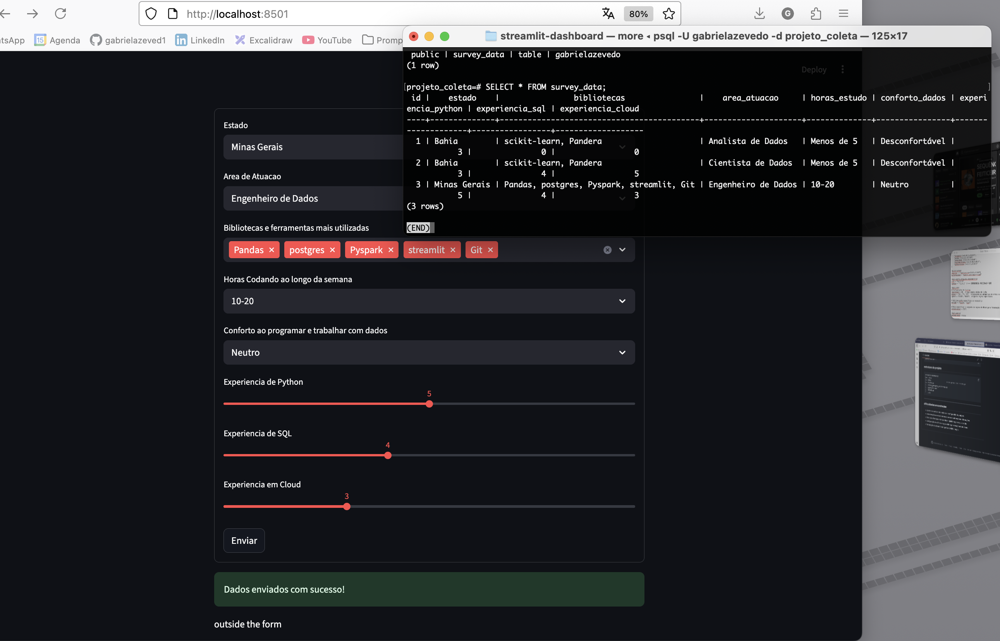

# streamlit dashboard - coleta de dados

## descrição do projeto

este projeto consiste em dois scripts em python para coletar dados de usuários sobre experiência com dados e programação. ambos utilizam **streamlit** para criar uma interface web interativa e amigável, permitindo que os usuários submetam respostas de forma simples e rápida.

o projeto oferece duas formas de armazenamento:

1. **csv local** (`coleta.py`)  
2. **banco de dados postgres** usando sqlalchemy (`coleta_postgres_sqlalchemy.py`)

o uso de streamlit permite desenvolver dashboards e formulários sem precisar de conhecimento avançado em frontend, tornando a coleta de dados muito mais rápida e acessível.

---



---

## estrutura do projeto 

```properties
streamlit-dashboard/
├── .venv/
├── data/                       # csv gerado pelo coleta.py
├── coleta.py
├── coleta_postgres_sqlalchemy.py
├── pyproject.toml
├── README.md
├── foto.png
└── .env

```

--- 

## requisitos

* python 3.12
* streamlit >=1.49.1,<2.0.0
* pandas >=2.3.2,<3.0.0
* sqlalchemy >=2.0.43,<3.0.0
* psycopg2-binary >=2.9.10,<3.0.0
* python-dotenv >=1.1.1,<2.0.0

opcional para desenvolvimento:

* ruff ^0.12.11
* taskipy ^1.14.1

---

## scripts

### coleta.py (salvando em csv)

* cria um **formulário streamlit** com campos:
  * estado
  * area de atuação
  * bibliotecas/ferramentas utilizadas
  * horas codando por semana
  * conforto ao trabalhar com dados
  * experiência em python, sql e cloud

* cria a pasta `data/` caso não exista  
* salva os dados em `data/survey_data.csv`  
* concatena novos dados ao csv existente, garantindo persistência  

**vantagens:**

* rápido de implementar  
* não depende de servidor de banco de dados  
* fácil de compartilhar ou versionar o csv  

---

### coleta_postgres_sqlalchemy.py (salvando em postgres)

* cria o mesmo **formulário streamlit**  
* conecta a um banco de dados postgres usando **sqlalchemy**  
* define a tabela `survey_data` usando ORM do sqlalchemy  
* cria a tabela se não existir  
* salva os dados diretamente no banco  

**vantagens:**

* ideal para dados que precisam ser consultados ou analisados por múltiplos usuários  
* permite consultas SQL avançadas  
* centraliza os dados, evitando problemas de múltiplos csvs  

---
## configuração do banco de dados

no arquivo `.env` coloque suas credenciais:

```bash
DB_HOST=localhost
DB_DATABASE=projeto_coleta
DB_USER=seu_usuario
DB_PASSWORD=sua_senha
```
---

## rodando os scripts

### csv

```bash
poetry run streamlit run coleta.py
```
### postgres

```bash
poetry run streamlit run coleta_postgres_sqlalchemy.py

```

### testando ruff

```bash
poetry run ruff .
```

---
## como conferir os dados no banco de dados via terminal

```bash
# acessar o banco de dados
psql -U seu_usuario -d projeto_coleta
```
```bash
# listar as tabelas
\dt
```
```bash
# visualizar registros
SELECT * FROM survey_data;
```

# sair do psql
\q

--- 

## dificuldades encontradas

* ajustes nas variáveis de ambiente e configuração do postgres  
* concatenação correta de dados no csv sem sobrescrever informações  
* lidar com diferenças entre pandas e sqlalchemy para salvar dados  
* configuração do ruff e taskipy para linting e execução automatizada  
* formatação do streamlit sem quebras de linha longas
